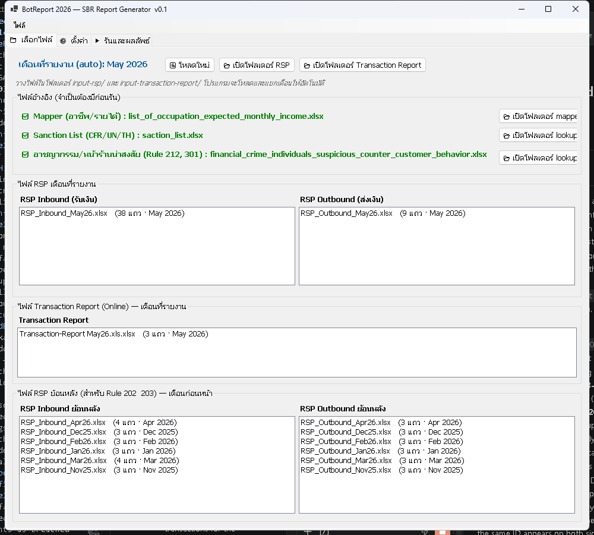
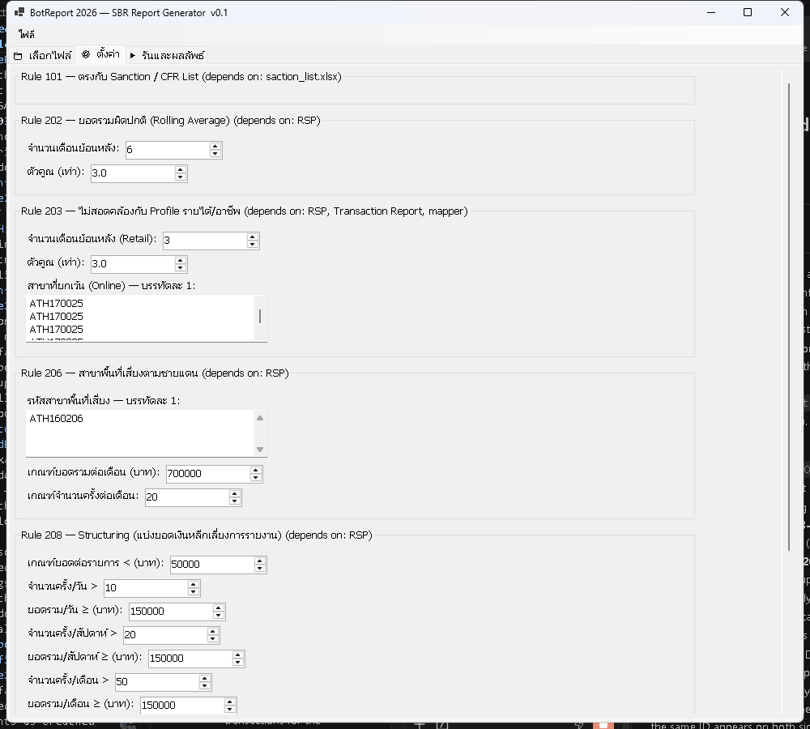
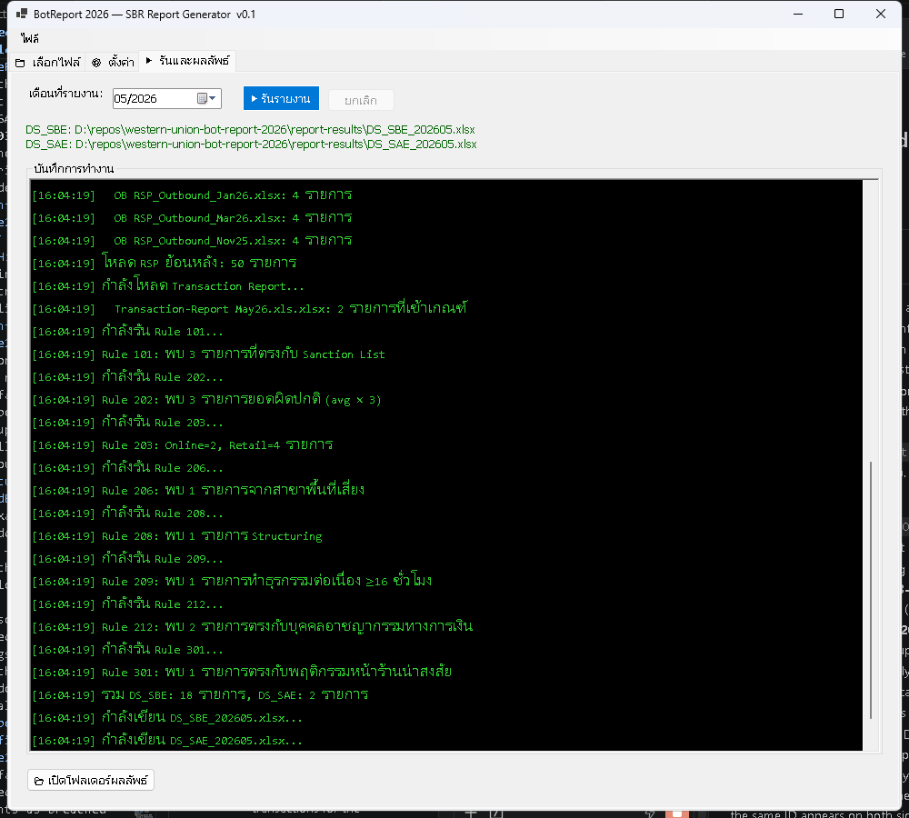

# BotReport 2026 — User Manual (English)

A monthly compliance tool that scans money-transfer transaction files and
produces the two datasets the Bank of Thailand (ธปท.) requires under the SBR
Dataset specification:

| Dataset | Code | Description |
|---|---|---|
| DS_SBE | 1.1 | Suspicious customer behavior, pre-EDD |
| DS_SAE | 1.2 | Enhanced Due Diligence (EDD) results |

Reports are due **15 days after the data date** (e.g. the May report is due
by June 15).

---

## 1. Getting the app running

1. Get the latest build — either the published app from the `Releases/`
   folder (unzip it) or run from source with .NET 8 installed
   (`dotnet run --project program/BotReport2026/BotReport2026.csproj`).
2. Launch **BotReport2026.exe**. On first launch it automatically creates
   the folders it needs next to itself:
   - `input-rsp-inbound/`
   - `input-rsp-outbound/`
   - `input-transaction-report/`
   - `lookups/`
   - `mapper/`
   - `report-results/`
3. The app must stay in the same relative position inside the folder
   structure it was built/extracted into — don't move the `.exe` on its own
   to a different folder, or it won't find `input-rsp-inbound/`, `lookups/`, etc.

No installer, no admin rights, no internet connection required.

---

## 2. Where files go

| Folder | What goes here |
|---|---|
| `input-rsp-inbound/` | This month's and prior months' **inbound** (received money) RSP files |
| `input-rsp-outbound/` | This month's and prior months' **outbound** (sent money) RSP files |
| `input-transaction-report/` | This month's (and ideally prior months') `Transaction-Report *` files (online channel) |
| `lookups/` | `saction_list.xlsx` (UN + TH sanction lists), the financial-crime / suspicious-retail-customer list |
| `mapper/` | The occupation → expected monthly income mapping file |
| `report-results/` | Where `DS_SBE_yyyyMM.xlsx` and `DS_SAE_yyyyMM.xlsx` are written after a run |

**RSP direction comes from the folder, not the file name.** Every file you
put in `input-rsp-inbound/` is read as inbound, and every file in
`input-rsp-outbound/` as outbound — so you can rename RSP files however you
like. Put each file in the right folder; that is the only thing that decides
its direction. The file extension doesn't matter (`.xlsx`, no extension, etc.
all work) as long as the content is a real Excel file.

Transaction Report files are still matched by name prefix
(`Transaction-Report...`) inside `input-transaction-report/`.

**The month is still read out of the filename** (a 3-letter month + 2-digit
year somewhere in the name, e.g. `May26`, `Apr_26`) — so keep the month in
the name even when you rename a file. If the app can't find a recognizable
month in a filename, it's treated conservatively as a **historical** file,
not the reporting month.

> **Upgrading from an earlier version?** RSP files used to live in a single
> `input-rsp/` folder. Move your `RSP_Inbound_*` files into
> `input-rsp-inbound/` and your `RSP_Outbound_*` files into
> `input-rsp-outbound/`. The old folder is no longer read at all.

**Keep several months of RSP history in both RSP folders.** Two rules need it:
Rule 202 needs up to 6 prior months by default, Rule 203 (retail) needs 3.
Files for months you're not reporting on don't need to be removed — the app
sorts everything into "reporting month" vs "historical" for you.

There is no in-app file picker for adding files — copy them into the
folders directly (Windows Explorer, drag-and-drop, etc.), then use the
🔄 **Reload** button in the app.

---

## 3. The three tabs

### Tab 1 — File Selection (📁 เลือกไฟล์)

- Shows the auto-detected **reporting month** at the top.
- **Reference files** panel: a ✅ or ❌ next to each of the three lookup
  files (occupation mapper, sanction list, crime/suspicious list). A ❌
  means the corresponding rule(s) will be skipped or incomplete for this
  run — it does not stop the run.
- Two panels list the reporting month's inbound/outbound RSP files, one
  panel lists the reporting month's Transaction Report files, and two more
  panels list the **historical** inbound/outbound RSP files being used for
  the rolling-window rules.
- 🔄 **Reload** — re-scans both input folders (use this after adding files
  while the app is already open).
- 📂 **Open folder** buttons — open the relevant folder in Explorer so you
  can drop files in without hunting for the path.

### Tab 2 — Settings (⚙️ ตั้งค่า)

One box per rule, showing its adjustable thresholds (see §5 below for what
each one means). Rules 101, 212, and 301 have no thresholds — they're
list-matching rules, shown for information only.

- 💾 **Save settings** — writes immediately to `config.json` next to the
  app.
- 📂 **Load settings** — reloads from `config.json`, discarding any unsaved
  changes on screen.

Settings are also saved automatically every time you click Run, whether or
not you clicked Save first.

### Tab 3 — Run & Output (▶ รันและผลลัพธ์)

- **Reporting month** picker (MM/YYYY) — this is the master control for
  "which month am I reporting on." Changing it re-sorts Tab 1's file lists
  to match.
- **▶ Run Report** — starts processing. Disabled while a run is in progress.
- **Cancel** — stops the run at the next safe checkpoint (between rules,
  not mid-rule).
- A black console-style log shows progress as the run executes.
- When done, the two output file paths are shown and **📂 Open results
  folder** becomes available.

The Run button refuses to start only if **all three** of reporting-month
inbound, outbound, and Transaction Report file lists are empty — you'll see
a warning dialog if so. It does **not** check the lookup files ahead of
time; missing ones just mean the dependent rule(s) produce nothing (except
the sanction list and occupation mapper, which will stop the run with an
error if the file is missing entirely, not just outdated).

---

## 4. Monthly workflow, start to finish

1. Copy this month's RSP Inbound file into `input-rsp-inbound/` and this
   month's RSP Outbound file into `input-rsp-outbound/`, leaving prior
   months' files from previous runs in place.
2. Copy this month's Transaction Report file into
   `input-transaction-report/`.
3. Confirm `lookups/` and `mapper/` still have current versions of the
   sanction list, crime/suspicious list, and occupation map.
4. Launch the app (or click 🔄 Reload if it's already open).
5. On **Tab 1**: confirm the auto-detected reporting month is correct, and
   that all three reference files show ✅. Check the file lists look
   right (correct files landed in "reporting" vs "historical").
6. On **Tab 2**: review the thresholds — usually left at default unless
   your compliance team has agreed on a change (see §5).
7. On **Tab 3**: double-check the reporting month, click **▶ Run Report**,
   and watch the log until it finishes.
8. Click **📂 Open results folder** and confirm `DS_SBE_yyyyMM.xlsx` and
   `DS_SAE_yyyyMM.xlsx` were created with the expected reporting-period
   code in the filename.
9. Submit both files through the BOT Data Acquisition System before the
   due date (data date + 15 days).

---

## 5. What each rule checks

Rules 201, 204, 205, and 210 are out of scope for this app (not required).

| Rule | What it flags |
|---|---|
| **101** | A transaction's sender/receiver matches the UN or TH/CFR sanction list (name + ID for UN; ID alone for TH). |
| **202** | This month's total transferred amount for a person is more than **3×** their average monthly amount over the prior 6 months. |
| **203 (Online)** | An online transaction was held for "proof of income" and later passed EDD anyway — reported with EDD results. |
| **203 (Retail)** | A person's transfer total over a rolling 3-month window exceeds **3×** the expected monthly income for their stated occupation. |
| **206** | Transactions at a designated high-risk border branch exceed 700,000 THB/month or 20 transactions/month (currently no branches are designated). |
| **208** | "Structuring" — many transactions just under 50,000 THB in a single day/week/month that add up past a running total. |
| **209** | A person transacts across a 16+ hour span within a single day. |
| **212** | Sender/receiver name matches a known financial-crime person list. |
| **301** | Transaction matches a "suspicious storefront customer" list by MTCN, ID, or name. |

**Inbound and outbound are evaluated independently.** For rules 202, 203
(Retail), 206, 208, and 209, a person's money *received* and money *sent*
are no longer pooled together — each direction is checked against the
threshold on its own. If only one direction crosses the threshold, only
that direction's transactions are reported; if both cross independently,
one record covering both is produced.

All numeric thresholds above are the **defaults** — every one of them is
adjustable on Tab 2 (see [04-configuration.md](../../program/.claude/instructions/04-configuration.md)
for the full technical list if you need exact field names).

---

## 6. Troubleshooting

| Symptom | Likely cause / fix |
|---|---|
| Warning: "กรุณาเลือกไฟล์อย่างน้อย 1 ไฟล์ก่อนรัน" (please select at least one file) when clicking Run | No files were found for the **reporting month** specifically. Check the filenames contain a recognizable month code, and that Tab 3's month picker matches. |
| A reference file shows ❌ on Tab 1 | The file is missing from `lookups/` or `mapper/`, or was renamed. Use the 📂 folder buttons to check, drop the correct file in, then 🔄 Reload. |
| Rule 202 or 203 isn't flagging anyone you expected | Check the two RSP folders actually have enough **prior months'** files present — these rules need rolling history, not just the reporting month. |
| An RSP file is listed under the wrong direction | It's in the wrong folder. Direction is decided purely by whether the file sits in `input-rsp-inbound/` or `input-rsp-outbound/` — the file name is not consulted. Move it and 🔄 Reload. |
| Wrong reporting month was auto-detected | Change it manually with the month picker on Tab 3 — Tab 1's file lists re-sort automatically to match. |
| A setting change on Tab 2 doesn't seem to apply | Make sure you clicked 💾 Save (or just Run — settings save automatically at the start of every run). |
| App can't find its folders / crashes on startup | The `.exe` was likely moved out of its original folder structure. Re-extract from the `Releases/` zip rather than copying just the `.exe`. |
| A run stops with an error mentioning the sanction list or occupation map | Those two files are required to exist (not just be current) for any run — unlike the crime/suspicious list, a missing file here stops the whole run rather than just skipping a rule. |

---

## 7. Notes

- Files are matched by content, not extension — EPPlus (the library reading
  the Excel files) opens by file content, so a real `.xlsx` works even if
  someone strips or changes the extension, as long as the filename prefix
  is correct.
- `config.json` (Tab 2's saved settings) lives right next to the `.exe`.
- Output files always use the pattern `DS_SBE_yyyyMM.xlsx` /
  `DS_SAE_yyyyMM.xlsx`, e.g. `DS_SBE_202605.xlsx` for May 2026.
